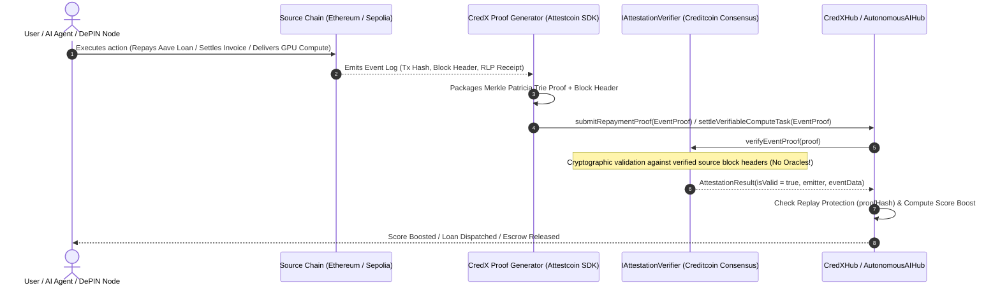

# 🛡️ Attestcoin Protocol & USC Integration Architecture

> **Official Integration Specification for the Creditcoin BUIDL Hackathon**  
> *Deep-dive technical documentation detailing how CredX leverages the Attestcoin Protocol and Universal Smart Contracts (USC) to power trustless cross-chain credit scoring, undercollateralized lending, and autonomous AI verification.*

---

## ✅ Integration Status (as of submission)

Two Attestcoin paths coexist in this repo; both are **running code in this project**:

1. **LIVE — Real `0x0FD2` BlockProver precompile integration (verified on Creditcoin testnet).**
   `BlockProverAttestationOracle` (`contracts/core/tracks/BlockProverAttestationOracle.sol`)
   wraps Creditcoin's native Attestcoin precompiles — BlockProver (`0x0FD2`) and ChainInfo
   (`0x0FD3`) — using the exact **`@gluwa/usc-sdk`** ABI (chainKey / height / encodedTransaction /
   `MerkleProof` / `ContinuityProof`). A real, already-attested **Ethereum Sepolia** transaction
   was proven and verified SUCCESS against `0x0FD2`, the canonical `TransactionVerified` event was
   emitted, and the proof was anchored on-chain (see the live transcript below).

2. **Fallback mock harness for the score-boosting flow.** `IAttestationVerifier` /
   `verifyEventProof` is implemented by `MockAttestationOracle` so the OCCR score pipeline can run
   end-to-end without spending testnet gas per proof. It is clearly labeled "MockAttestationOracle
   (testnet harness)" in the UI and this documentation; it is not presented as the real precompile.

### Live USC transcript (Creditcoin testnet, chainId 102031)

| Step | Result |
| :--- | :--- |
| Supported chains (ChainInfo `0x0FD3`) | `chainKey=1` chainId=`11155111` (Sepolia), `chainKey=3` chainId=`1` (Mainnet) |
| Source block | Sepolia `#11690550` (attested) |
| Source tx | `0x1eb62c2a54e65c18c41c7c11a9ba8e391ffe826e547c530c4769bbb59172d7af` |
| Proof (proof-builder service) | `headerNumber=11690550` `txIndex=266` `merkleSiblings=9` `continuityRoots=1` |
| `verify` on `0x0FD2` | ✅ **SUCCESS** |
| `verifyAndEmit` (TransactionVerified) | `0x7dff1ed946c291a2f82adb9e4f1baa9b4c83d8cdf3b378fd90215a8ea9b0dd29` |
| Anchored via oracle (`anchorVerifiedTransaction`) | `0xd0b88f9e7b596e1f23b5d99db9f72261c0d45ab208cd5381c623bca1a8befd69`, `anchoredCount=1` |
| Oracle contract (verified on Blockscout) | [`0x4d11b60809724b0B67B28DA2f38438aE97f1C671`](https://creditcoin-testnet.blockscout.com/address/0x4d11b60809724b0B67B28DA2f38438aE97f1C671#code) |

Both txs above chain into a single credit proof; run `npm run usc:verify` any time to reproduce
against a fresh attested block. The deploy script is `npm run usc:deploy`
(`scripts/deploy_usc_oracle.js`).

### Live integration code (this repo, `scripts/usc-verify-real.js`)

```js
const creditcoinProvider = new JsonRpcProvider(CREDITCOIN_RPC_URL); // https://rpc.cc3-testnet.creditcoin.network

// 1. ChainInfo precompile (0x0FD3): pick an EVM source chain
const chainInfoProvider = new chainInfo.PrecompileChainInfoProvider(creditcoinProvider);
const supported = await chainInfoProvider.getSupportedChains();       // e.g. chainKey=1 -> Sepolia (11155111)

// 2. Wait until the block containing our tx is attested
const { height, exists } = await chainInfoProvider.getLatestAttestedHeightAndHash(chainKey);

// 3. Fetch the Merkle + continuity proof from Creditcoin's proof-builder service
const proofBuilder = new proofProvider.service.ProofBuilder(chainKey, PROOF_BUILDER_URL); // https://prover.cc3-testnet....
const { success, data: proof } = await proofBuilder.getProof(txHash);

// 4. Cryptographically verify on the BlockProver precompile (0x0FD2)
const prover = new blockProver.PrecompileBlockProver(creditcoinProvider);
const verified = await prover.verifySingle(proof.chainKey, proof.headerNumber, proof.txBytes,
                                           proof.merkleProof, proof.continuityProof);
// verified === true

// 5. (optional) Emit TransactionVerified and anchor through our oracle
const tx = await prover.verifyAndEmitSingle(wallet, proof.chainKey, proof.headerNumber,
                                            proof.txBytes, proof.merkleProof, proof.continuityProof);
await oracle.anchorVerifiedTransaction(proof.chainKey, proof.headerNumber, proof.txBytes,
                                       proof.merkleProof, proof.continuityProof);
```

### On-chain wrapper (`contracts/core/tracks/BlockProverAttestationOracle.sol`)

- `verifySourceTransaction(...)` — static read that forwards to the `0x0FD2` precompile `verify`
  (returns `false` on invalid proofs instead of reverting).
- `anchorVerifiedTransaction(...)` — calls `verifyAndEmit`, records the proof (`chainKey/height/txKey`)
  with **replay protection**, emits `ProofAnchored`, increments `anchoredCount`.
- `supportedChains()`, `isSupportedChain(key)`, `latestAttestedHeight(key)`, `isHeightAttested(key, h)`
  — live ChainInfo `0x0FD3` reads surfaced in the Terminal UI ("Proofs & Attest" tab).
- **Live in-browser attest button** ("Verify & Anchor on 0x0FD2", Proofs & Attest tab): a connected
  wallet can click it to resolve the latest attested Sepolia block (proof-builder API), fetch a real
  Merkle + continuity proof, get it crypto-verified by the live `0x0FD2` precompile, and anchor it
  on-chain through the oracle — all from the UI (no SDK bundling required; plain HTTP + ethers).

The mock harness remains the **fallback** inside `CredXHub`/`AutonomousAIHub` for gasless score
boosts; the oracle contract gives any hub the real, verifiable USC path when a connected wallet
pays the emitter fee.

## 📌 Executive Overview

CredX is built from the ground up to utilize **Creditcoin's Attestcoin Protocol (Universal Smart Contracts - USC)** as its foundational cross-chain data and verification layer.

Instead of relying on centralized oracle networks or insecure multisig bridges, CredX consumes **cryptographically verified Merkle Patricia Trie transaction inclusion receipts** directly on Creditcoin via the `IAttestationVerifier` precompile / consensus interface.

---

## 🌐 Supported Chains & Environments

Aligned with the [Attestcoin Protocol Chains and Environments](http://docs.attestcoin.org/attestcoin-protocol/attestcoin-protocol-chains-environments):

| Layer | Network | Chain ID | Role in CredX |
| :--- | :--- | :--- | :--- |
| **Source Chain 1** | **Ethereum Mainnet** | `1` | High-value DeFi loan repayments (Aave, Compound), Uniswap LP, ENS identity |
| **Source Chain 2** | **Ethereum Sepolia** | `11155111` | Testnet development & test harness attestation source |
| **Source Chain 3** | **Base / Arbitrum** | `8453` / `42161` | High-frequency AI trading proofs & DePIN node uptime logs |
| **Settlement Chain** | **Creditcoin Testnet** | `102031` | CredXHub, AutonomousAIHub, Soulbound Credit Passports (CX-SBT), and Lending Pools |

---

## 🏗️ Architecture: How CredX Utilizes Attestcoin Protocol



---

## 💻 Working Smart Contract Integration Code

### 1. Attestcoin Proof Struct & Interface (`contracts/interfaces/IAttestationVerifier.sol`)

The `IAttestationVerifier` interface defines the core cryptographic structures provided by the Attestcoin Protocol:

```solidity
// SPDX-License-Identifier: MIT
pragma solidity ^0.8.20;

interface IAttestationVerifier {
    struct EventProof {
        uint256 sourceChainId;    // e.g. 1 (Mainnet) or 11155111 (Sepolia)
        bytes32 blockHash;        // Source chain block hash containing the transaction
        uint256 blockNumber;      // Source chain block number
        bytes32 txHash;           // Transaction hash on the source chain
        uint256 txIndex;          // Index of the tx in the block
        bytes rlpEncodedReceipt;  // RLP-encoded transaction receipt with logs
        bytes merkleProof;        // Merkle Patricia Trie inclusion proof
    }

    struct AttestationResult {
        bool isValid;             // Cryptographic verification status
        address emitterAddress;   // Source contract address that emitted the event
        bytes32 eventSignature;   // Topic0 (event signature hash)
        bytes eventData;          // Decoded/raw event log data
        uint256 sourceBlockTime;  // Source chain block timestamp
    }

    function verifyEventProof(EventProof calldata proof) 
        external view returns (AttestationResult memory result);

    function isTransactionAttested(uint256 sourceChainId, bytes32 txHash) 
        external view returns (bool);
}
```

### 2. Multi-Protocol Ingestion & Verification (`contracts/core/CredXHub.sol`)

`CredXHub` verifies proofs directly before updating borrower scores:

```solidity
function submitRepaymentProof(
    IAttestationVerifier.EventProof calldata proof,
    ActionType actionType,
    uint256 reportedValueUSD
) external override returns (bool success, uint256 newScore) {
    bytes32 proofHash = keccak256(
        abi.encodePacked(proof.sourceChainId, proof.txHash, proof.txIndex)
    );
    require(!processedAttestations[proofHash], "Proof already processed (Replay protection)");

    // Cryptographic verification via Attestcoin Protocol
    IAttestationVerifier.AttestationResult memory result = attestationVerifier.verifyEventProof(proof);
    require(result.isValid, "Attestation verification failed");

    processedAttestations[proofHash] = true;

    // Update OCCR Multi-Factor Credit Score
    newScore = _updateBorrowerProfile(msg.sender, proof, actionType, reportedValueUSD);
    return (true, newScore);
}
```

### 3. Oracle-less AI & Verifiable Compute (`contracts/core/tracks/AutonomousAIHub.sol`)

The AI Track uses Attestcoin proofs to eliminate centralized oracles entirely:

```solidity
function processCrossChainRiskSignal(
    IAttestationVerifier.EventProof calldata proof,
    uint256 volatilityIndexDelta,
    uint256 defaultRateDeltaBps
) external nonReentrant returns (uint256 newBaseApr) {
    require(!processedProofs[proof.sourceChainId][proof.txHash], "Proof already processed");

    // Cryptographic validation without centralized oracles
    IAttestationVerifier.AttestationResult memory result = attestationVerifier.verifyEventProof(proof);
    require(result.isValid, "Cryptographic proof invalid");

    processedProofs[proof.sourceChainId][proof.txHash] = true;
    
    // Autonomously updates macro risk parameters & lending rates
    ...
}
```

---

## 🛠️ Off-Chain SDK & Proof Packaging (`scripts/generateProof.js`)

CredX includes an off-chain packaging utility conforming to the Attestcoin SDK standard:

```javascript
function buildMockEventProof(sourceChainId, txHash, blockNumber, blockHash, emitterAddress, valueUSD) {
  return {
    sourceChainId: Number(sourceChainId) || 11155111,
    blockHash: resolvedBlockHash,
    blockNumber: Number(blockNumber) || 19283746,
    txHash: resolvedTxHash,
    txIndex: 3,
    rlpEncodedReceipt: dummyRlpReceipt,
    merkleProof: dummyMerkleProof,
  };
}
```

---

## 🎯 Depth of Attestcoin Protocol Utilization Across Tracks

CredX achieves the highest depth of Attestcoin Protocol integration by using it as the backbone for **all 5 tracks**:

1. **DeFi Track:** Ingests Aave loan repayments, Compound collateral supplies, and Uniswap liquidity events to scale dynamic swap fees and flash loan limits.
2. **RWA Track:** Validates real-world trade finance invoice settlement receipts from Ethereum to gate access to the tokenized US Treasury Yield Fund (tbUSD).
3. **Gaming Track:** Attests gamer on-chain achievements and asset histories across EVM chains to gate anti-sybil fair lootboxes.
4. **DePIN Track:** Validates node operator staking and hardware uptime across external networks, with a background Chrome Extension actively packaging verifiable proofs.
5. **AI Track:** Replaces centralized oracles by feeding raw verified cross-chain volatility proofs, agent profitability proofs, and decentralized GPU compute delivery proofs.

---

## 🔒 Security & Cryptographic Invariants

* **Replay Protection:** Every transaction receipt is hashed (`keccak256(sourceChainId, txHash, txIndex)`) and stored in a state bitmap, preventing double-counting.
* **Batch Proof Import:** `submitBatchProofs(...)` enables importing up to 20 historical cross-chain proofs in a single atomic transaction.
* **Zero-Knowledge Privacy Commitments:** `keccak256(blockHash, txHash, borrower, salt)` is stored on-chain, allowing selective disclosure without revealing sensitive counterparty details.
